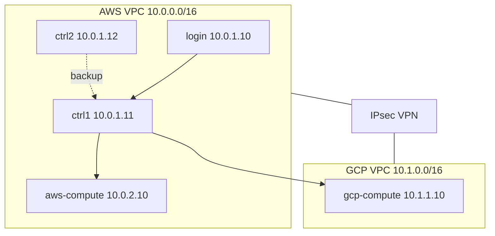

# Slurm Hybrid Cluster (AWS + GCP)

Terraform-baserad infrastruktur för ett **hybrid Slurm-kluster** med:

| Roll | Plats | Antal |
|------|--------|-------|
| Login | AWS | 1 |
| Controller (`slurmctld` + `slurmdbd`) | AWS | 2 (aktiv/reserv) |
| Compute | AWS | 1 (`aws-compute`) |
| Compute | GCP | 1 (`gcp-compute`) |

Compute-noder körs som **`State=CLOUD`** med **power save** enligt [Slurm Power Saving Guide](https://slurm.schedmd.com/power_save.html): `SuspendProgram` / `ResumeProgram` stoppar och startar VM:ar via AWS/GCP API.

Övrig dokumentation: [Slurm documentation](https://slurm.schedmd.com/documentation.html).

## Arkitektur



- **Nätverk:** Site-to-site VPN mellan AWS VGW och GCP Classic VPN (`terraform/hybrid_vpn.tf`).
- **Slurm:** `slurm/slurm.conf` — partition `hybrid` / `cloud` med `SuspendTime=300` endast på cloud-noder; controllers och login undantas via `SuspendExcNodes`.
- **Power save:** `scripts/slurm_resume` och `scripts/slurm_suspend` på controllers (kräver AWS IAM + GCP service account).

## Regioner (Stockholm)

| Moln | Region | Zon |
|------|--------|-----|
| AWS | `eu-north-1` (Stockholm) | automatisk AZ |
| GCP | `europe-north2` (Stockholm) | `europe-north2-a` |

## GitHub Actions

Två workflows under `.github/workflows/`:

| Workflow | Fil | Syfte |
|----------|-----|--------|
| **Terraform Apply** | `terraform-apply.yml` | Skapar infrastruktur + jobb **bootstrap-slurm** (Munge, Slurm build, slurmctld/slurmd) |
| **Slurm Bootstrap** | `slurm-bootstrap.yml` | Endast bootstrap (om Apply redan körts) |
| **Terraform Destroy** | `terraform-destroy.yml` | Raderar all infrastruktur (kräver `confirm_destroy=destroy`) |

Apply körs vid `workflow_dispatch` och push till `main`. Efter lyckad Apply startar **bootstrap-slurm** automatiskt (~60–90 min, bygger Slurm på ctrl1 och synkar till övriga noder). Destroy körs **endast manuellt** med bekräftelse.

### Förberedelse (engång)

1. **Remote state** i AWS Stockholm:

   ```bash
   chmod +x scripts/bootstrap-tf-state.sh
   ./scripts/bootstrap-tf-state.sh slurm-hybrid-tfstate slurm-hybrid-tflock eu-north-1
   ```

2. **OIDC + Workload Identity Federation** (inga långlivade AWS/GCP-nycklar i GitHub):

   ```bash
   chmod +x scripts/bootstrap-ci-oidc.sh
   gcloud config set project dcprod
   ./scripts/bootstrap-ci-oidc.sh
   ```

   Det skapar (via `terraform/bootstrap-ci/`):

   - AWS: OIDC-provider för `token.actions.githubusercontent.com` + IAM-roll
   - GCP: WIF-pool/provider + service account `github-slurm-hybrid-ci@dcprod.iam.gserviceaccount.com`

   Kopiera utskriften till **GitHub → Settings → Variables → Actions**:

   | Variable | Exempel |
   |----------|---------|
   | `AWS_ROLE_ARN` | `arn:aws:iam::230278678315:role/github-slurm-hybrid-terraform` |
   | `GCP_WORKLOAD_IDENTITY_PROVIDER` | `projects/…/locations/global/workloadIdentityPools/github-pool/providers/github-provider` |
   | `GCP_SERVICE_ACCOUNT` | `github-slurm-hybrid-ci@dcprod.iam.gserviceaccount.com` |
   | `GCP_PROJECT_ID` | `dcprod` |

   Ta bort gamla secrets om de finns: `AWS_ACCESS_KEY_ID`, `AWS_SECRET_ACCESS_KEY`, `GCP_SA_KEY`.

3. **GitHub repository secrets**:

   | Secret | Beskrivning |
   |--------|-------------|
   | `SSH_PUBLIC_KEY` | Publik SSH-nyckel för `slurmadmin` (måste matcha privat nyckel) |
   | `SSH_PRIVATE_KEY` | **Privat** nyckel till samma par (krävs för bootstrap-jobb) |
   | `TF_STATE_BUCKET` | S3-bucket från bootstrap |
   | `TF_STATE_LOCK_TABLE` | DynamoDB-tabell från bootstrap |
   | `SLURM_DB_PASSWORD` | Valfritt; annars läses `terraform output db_password` i bootstrap |

4. **Environments**: `production` och `production-destroy` (OIDC `sub` tillåter dessa).

5. **Repository variable** (valfritt): `ALLOWED_SSH_CIDR` — begränsa SSH till er IP.

Workflows kräver `permissions: id-token: write` (redan satt) så GitHub kan utfärda OIDC-token till AWS/GCP.

Lokal init med samma backend:

```bash
cd terraform
terraform init -backend-config=backend.hcl.example
```

### Köra från GitHub

- **Actions → Terraform Apply (create infra) → Run workflow**
- **Actions → Terraform Destroy → Run workflow** och skriv `destroy` i bekräftelsefältet

## Förutsättningar

- Terraform >= 1.5
- AWS CLI konfigurerad (`aws configure`)
- GCP-projekt med `gcloud auth application-default login`
- SSH-nyckel (publik) för användaren `slurmadmin`
- API aktiverade på GCP: Compute Engine API

### SSH-nycklar (viktigt)

| Var | Nyckel | Användare |
|-----|--------|-----------|
| Din laptop / GitHub Actions | `~/.ssh/slurm_deploy` (privat) + secret `SSH_PUBLIC_KEY` / `SSH_PRIVATE_KEY` | `slurmadmin` på login, ctrl1, ctrl2 |
| AWS EC2 `key_name` (samma publika nyckel via Terraform) | samma par | **`ubuntu`** på alla AWS-VM:ar (standard för Ubuntu AMI) |
| Inre hopp från ctrl1 | `~/.ssh/id_cluster` på ctrl1 (= samma privata nyckel som deploy) | `slurmadmin@10.0.x.x` |

`slurmadmin` får sin publika nyckel via **cloud-init** (`ssh_authorized_keys` + `authorized_keys`-fil). Om cloud-init misslyckats på t.ex. compute (`10.0.2.10`) får du `Permission denied (publickey)` trots att `ubuntu@10.0.2.10` fungerar med samma `-i`-nyckel.

**Åtgärd utan omprovisionering** (från laptop, via ctrl1):

```bash
export CTRL1_IP=$(cd terraform && terraform output -raw ctrl1_public_ip)
export SSH_KEY=~/.ssh/slurm_deploy
bash scripts/repair-slurmadmin-ssh.sh
```

**Verifiera från ctrl1:**

```bash
ssh -i ~/.ssh/id_cluster slurmadmin@10.0.2.10 hostname
```

## Snabbstart

```bash
cd terraform
cp terraform.tfvars.example terraform.tfvars
# Redigera: gcp_project_id, ssh_public_key

terraform init -backend-config=backend.hcl.example
terraform plan
terraform apply
```

Efter `apply`:

```bash
terraform output -json db_password
terraform output login_ssh
```

### Post-deploy (obligatoriskt)

1. **Munge-nyckel** — genereras på `ctrl1`, kopiera till alla noder:

   ```bash
   ssh slurmadmin@$(terraform output -raw login_public_ip)  # hop via ctrl1
   # På ctrl1:
   sudo scp /etc/munge/munge.key slurmadmin@login:/tmp/
   # Upprepa för ctrl2, aws-compute; för gcp-compute via VPN IP 10.1.1.10
   ```

2. **GCP credentials på controllers** (för resume/suspend av `gcp-compute`):

   ```bash
   terraform output -raw power_save_gcp_key > gcp-sa.json
   scp gcp-sa.json slurmadmin@<ctrl1>:/tmp/
   ssh slurmadmin@<ctrl1> 'sudo mv /tmp/gcp-sa.json /etc/slurm/gcp-sa.json && sudo chmod 600 /etc/slurm/gcp-sa.json'
   sudo gcloud auth activate-service-account --key-file=/etc/slurm/gcp-sa.json
   ```

3. **Verifiera kluster:**

   ```bash
   ssh slurmadmin@<login>
   sinfo
   scontrol show nodes aws-compute,gcp-compute
   ```

4. **Testa power save:**

   ```bash
   # Manuellt power down (stänger VM)
   sudo scontrol power down aws-compute,gcp-compute
   sinfo   # POWERED_DOWN / CLOUD

   # Power up (startar VM, väntar ResumeTimeout)
   sudo scontrol power up aws-compute,gcp-compute
   ```

   Automatiskt: lämna nod IDLE i > `SuspendTime` (300 s) i partition `cloud`.

5. **Testjobb:**

   ```bash
   sbatch -p hybrid --wrap='hostname && sleep 10'
   squeue
   ```

## Terraform-layout

```
terraform/
  main.tf              # Providers, moduler
  hybrid_vpn.tf        # AWS ↔ GCP VPN
  modules/aws/         # Login, ctrl1/2, aws-compute, VPC, IAM
  modules/gcp/         # gcp-compute, VPC, VPN GW
slurm/                 # slurm.conf, slurmdbd.conf
scripts/               # install, bootstrap, resume/suspend
```

## Viktiga konfigurationsfiler

| Fil | Syfte |
|-----|--------|
| `slurm/slurm.conf` | Kluster, controllers, CLOUD-noder, power save |
| `slurm/slurmdbd.conf` | Accounting (MariaDB på ctrl1) |
| `/etc/slurm/cloud-nodes.json` | Mapping nod → instance ID / provider |
| `scripts/slurm_resume` | `ResumeProgram` — EC2/GCE start |
| `scripts/slurm_suspend` | `SuspendProgram` — EC2/GCE stop |

## Power save (SchedMD)

Konfigurerat enligt [power_save.html](https://slurm.schedmd.com/power_save.html):

- `ResumeProgram` / `SuspendProgram` på **slurmctld** (controllers)
- `SuspendTime=300` på partition `cloud` / `hybrid` (globalt `INFINITE` + `SuspendExcNodes` för login/ctrl)
- `State=CLOUD` på `aws-compute` och `gcp-compute`
- `ResumeTimeout=600`, `SuspendTimeout=120`
- Hybrid-mönster: cloud-noder i egen partition med suspend — se avsnitt *Hybrid Cluster* i guiden

## AWS VPC

Endast **en** AWS VPC ska finnas för detta repo: Terraform skapar och hanterar `slurm-hybrid-aws-vpc` i `eu-north-1` (`terraform/modules/aws/`). En äldre tom VPC med namnet `slurm-hpc-cluster-vpc` var en **orphan** (lämnad kvar utanför Terraform) och har tagits bort manuellt så att den inte förväxlas med den aktiva VPC:n.

## Felsökning VPN

```bash
# AWS
aws ec2 describe-vpn-connections --filters Name=tag:Name,Values=slurm-hybrid-vpn-gcp

# GCP
gcloud compute vpn-tunnels list --regions=europe-north2
```

Om tunnel inte går upp vid första `apply`, kör `terraform apply` igen efter att båda sidors IP-adresser stabiliserats (vanligt vid cross-cloud VPN).

## Säkerhet

- Begränsa `allowed_ssh_cidr` i `terraform.tfvars`
- Rotera `db_password` och GCP SA-nyckel
- Använd AWS Secrets Manager / GCP Secret Manager i produktion
- Munge-nyckel får inte läcka

## Rensa

```bash
cd terraform && terraform destroy
```

## Licens / support

Slurm är licensierat av SchedMD — se [https://slurm.schedmd.com](https://slurm.schedmd.com). Denna repo är en referensimplementation; anpassa instanstyper, regioner och HA efter er miljö.
